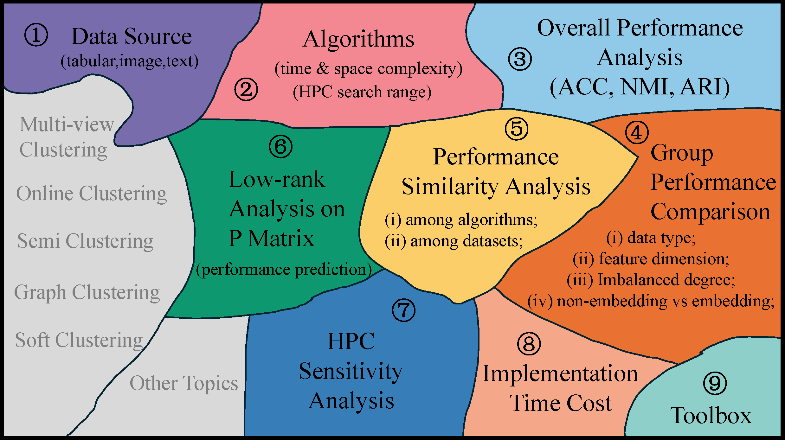

# 📖 CLUBench (A Clustering Benchmark).





## ✅ *Abstract*
Clustering is a fundamental problem in data science with a long-standing research history. Over the past decades, numerous clustering algorithms, ranging from conventional machine learning approaches to deep clustering methods, have been developed. Despite this progress, a systematic and large-scale empirical evaluation that jointly considers conventional algorithms, deep learning-based methods and recent foundation model-based clustering remains largely absent, leading to limited guidance on algorithm selection and deployment. To address this gap, we introduce CLUBench, a comprehensive clustering benchmark comprising 24 algorithms of diverse principles evaluated on 131 datasets across tabular, text and image data. Importantly, CLUBench provides a unified comparison between state-of-the-art baselines and foundation model-energized clustering strategies on all three modalities (tabular, text and image). Extensive experiments (178,815) in CLUBench yield statistically meaningful insights and identify promising yet underexplored pathways about clustering research. For example, we observe low-rank structure in cross-model performance matrices, which facilitates an efficient strategy for rapid algorithm evaluation and selection in practical applications. In addition, we provide an easy-to-use toolbox by encapsulating the source codes from the official code repository into a unified framework, accompanied by detailed instructions.


## 📊 **Deep Clustering Methods**
- [Unsupervised Deep Embedding for Clustering Analysis (DEC), ICML 2016](https://proceedings.mlr.press/v48/xieb16.html)
- [Improved Deep Embedded Clustering with Local Structure Preservation (IDEC), IJCAI 2017](https://www.ijcai.org/proceedings/2017/0243.pdf)
- [Deep Subspace Clustering Networks (DSCN), NeurIPS 2017](https://arxiv.org/abs/1709.02508),  [[Original Code]](https://github.com/panji530/Deep-subspace-clustering-networks)
- [Deep Semantic Clustering by Partition Confidence Maximisation (PICA), CVPR 2020](https://openaccess.thecvf.com/content_CVPR_2020/papers/Huang_Deep_Semantic_Clustering_by_Partition_Confidence_Maximisation_CVPR_2020_paper.pdf), [[Original Code]](https://github.com/Raymond-sci/PICA)
- [Contrastive clustering (ConClu), AAAI 2021](https://arxiv.org/abs/2009.09687), [[Original Code]](https://github.com/Yunfan-Li/Contrastive-Clustering)
- [Efficient Deep Embedded Subspace Clustering (EDESC), CVPR 2022](https://openaccess.thecvf.com/content/CVPR2022/papers/Cai_Efficient_Deep_Embedded_Subspace_Clustering_CVPR_2022_paper.pdf), [[Original Code]](https://github.com/JinyuCai95/EDESC-pytorch)
- [Dual Mutual Information Constraints for Discriminative Clustering (DMICC), AAAI 2023](https://ojs.aaai.org/index.php/AAAI/article/view/26032), [[Original Code]](https://github.com/Li-Hyn/DMICC)
- [DivClust: Controlling Diversity in Deep Clustering (DIVC), CVPR 2023](https://openaccess.thecvf.com/content/CVPR2023/papers/Metaxas_DivClust_Controlling_Diversity_in_Deep_Clustering_CVPR_2023_paper.pdf), [[Original Code]](https://github.com/ManiadisG/DivClust)
- [P<sup>2</sup>OT: Progressive Partial Optimal Transport for Deep Imbalanced Clustering (P<sup>2</sup>OT), ICLR 2024](https://arxiv.org/abs/2401.09266), [[Original Code]](https://github.com/rhfeiyang/PPOT)
- [Learning from Sample Stability for Deep Clustering (LFSS), ICML 2025](https://proceedings.mlr.press/v267/li25am.html), [[Original Code]](https://github.com/LZX-001/LFSS)


## 📊 **Benchmark Datasets**

### Source From:
- Jeon, Hyeon, et al. "Measuring the validity of clustering validation datasets." IEEE Transactions on Pattern Analysis and Machine Intelligence (2025).
- https://www.openml.org/search?type=data&status=active

| ID | Dataset | Type | size | dim | clusters | r_mm | r_ma | IR |
|---:|:---|---|---:|---:|:---:|:---:|:---:|:---:|
| [1] | echocardiogram | tabular | 61 | 10 | 2 | 0.386 | 0.279 | 0.221 |
| [2] | skillcraft1_master_table_dataset | tabular | 3303 | 18 | 6 | 0.206 | 0.051 | 0.071 |
| [3] | breast_cancer_wisconsin_original | tabular | 683 | 9 | 2 | 0.538 | 0.350 | 0.150 |
| [4] | smoker_condition | tabular | 1012 | 7 | 2 | 0.656 | 0.396 | 0.104 |
| [5] | glass_identification | tabular | 214 | 9 | 6 | 0.118 | 0.042 | 0.127 |
| [6] | statlog_image_segmentation | tabular | 2310 | 19 | 7 | 1.000 | 0.143 | 0.000 |
| [7] | planning_relax | tabular | 182 | 12 | 2 | 0.400 | 0.286 | 0.214 |
| [8] | customer_classification | tabular | 1000 | 11 | 4 | 0.772 | 0.217 | 0.025 |
| [9] | pima_indians_diabetes_database | tabular | 768 | 8 | 2 | 0.536 | 0.349 | 0.151 |
| [10] | mobile_price_classification | tabular | 2000 | 20 | 4 | 1.000 | 0.250 | 0.000 |
| [11] | spambase | tabular | 4601 | 57 | 2 | 0.650 | 0.394 | 0.106 |
| [12] | rice_seed_gonen_jasmine | tabular | 9999 | 10 | 2 | 0.821 | 0.451 | 0.049 |
| [13] | heart_attack_analysis_prediction_dataset | tabular | 303 | 13 | 2 | 0.836 | 0.455 | 0.045 |
| [14] | user_knowledge_modeling | tabular | 258 | 5 | 4 | 0.273 | 0.093 | 0.098 |
| [15] | world12d | tabular | 150 | 12 | 5 | 0.190 | 0.053 | 0.088 |
| [16] | pumpkin_seeds | tabular | 2500 | 12 | 2 | 0.923 | 0.480 | 0.020 |
| [17] | iris | tabular | 150 | 4 | 3 | 1.000 | 0.333 | 0.000 |
| [18] | wine | tabular | 178 | 13 | 3 | 0.676 | 0.270 | 0.053 |
| [19] | letter_recognition | tabular | 9992 | 16 | 26 | 0.904 | 0.037 | 0.001 |
| [20] | mammographic_mass | tabular | 830 | 5 | 2 | 0.944 | 0.486 | 0.014 |
| [21] | breast_tissue | tabular | 106 | 9 | 6 | 0.636 | 0.132 | 0.028 |
| [22] | hepatitis | tabular | 80 | 19 | 2 | 0.194 | 0.163 | 0.338 |
| [23] | predicting_pulsar_star | tabular | 9273 | 8 | 2 | 0.101 | 0.092 | 0.408 |
| [24] | breast_cancer_wisconsin_prognostic | tabular | 569 | 30 | 2 | 0.594 | 0.373 | 0.127 |
| [25] | wireless_indoor_localization | tabular | 2000 | 7 | 4 | 1.000 | 0.250 | 0.000 |
| [26] | date_fruit | tabular | 898 | 34 | 7 | 0.319 | 0.072 | 0.062 |
| [27] | zoo | tabular | 101 | 16 | 7 | 0.098 | 0.040 | 0.118 |
| [28] | htru2 | tabular | 9999 | 8 | 2 | 0.101 | 0.092 | 0.408 |
| [29] | ionosphere | tabular | 351 | 34 | 2 | 0.560 | 0.359 | 0.141 |
| [30] | music_genre_classification | tabular | 1000 | 26 | 10 | 1.000 | 0.100 | 0.000 |
| [31] | spectf_heart | tabular | 80 | 44 | 2 | 1.000 | 0.500 | 0.000 |
| [32] | rice_dataset_cammeo_and_osmancik | tabular | 3810 | 7 | 2 | 0.748 | 0.428 | 0.072 |
| [33] | ph_recognition | tabular | 653 | 3 | 15 | 0.864 | 0.058 | 0.002 |
| [34] | banknote_authentication | tabular | 1372 | 4 | 2 | 0.801 | 0.445 | 0.055 |
| [35] | wine_quality | tabular | 4873 | 11 | 5 | 0.074 | 0.033 | 0.160 |
| [36] | cardiovascular_study | tabular | 2927 | 15 | 2 | 0.179 | 0.152 | 0.348 |
| [37] | statlog_german_credit | tabular | 1000 | 24 | 2 | 0.429 | 0.300 | 0.200 |
| [38] | boston | tabular | 154 | 13 | 3 | 0.371 | 0.169 | 0.121 |
| [39] | seismic_bumps | tabular | 646 | 24 | 2 | 0.071 | 0.067 | 0.433 |
| [40] | dry_bean | tabular | 9997 | 16 | 7 | 0.147 | 0.038 | 0.065 |
| [41] | credit_risk_classification | tabular | 976 | 11 | 2 | 0.239 | 0.193 | 0.307 |
| [42] | epileptic_seizure_recognition | tabular | 5750 | 178 | 5 | 1.000 | 0.200 | 0.000 |
| [43] | website_phishing | tabular | 1353 | 9 | 3 | 0.147 | 0.076 | 0.188 |
| [44] | optical_recognition_of_handwritten_digits | tabular | 3823 | 64 | 10 | 0.967 | 0.098 | 0.001 |
| [45] | siberian_weather_stats | tabular | 1407 | 11 | 7 | 0.073 | 0.024 | 0.122 |
| [46] | orbit_classification_for_prediction_nasa | tabular | 1722 | 11 | 3 | 0.065 | 0.056 | 0.371 |
| [47] | magic_gamma_telescope | tabular | 9999 | 10 | 2 | 0.542 | 0.352 | 0.148 |
| [48] | raisin | tabular | 900 | 7 | 2 | 1.000 | 0.500 | 0.000 |
| [49] | patient_treatment_classification | tabular | 4412 | 10 | 2 | 0.679 | 0.404 | 0.096 |
| [50] | fetal_health_classification | tabular | 2126 | 21 | 3 | 0.106 | 0.083 | 0.316 |
| [51] | dermatology | tabular | 358 | 34 | 6 | 0.180 | 0.056 | 0.373 |
| [52] | secom | tabular | 1567 | 590 | 2 | 0.071 | 0.066 | 0.000 |
| [53] | paris_housing_classification | tabular | 10000 | 17 | 2 | 0.145 | 0.127 | 0.053 |
| [54] | seeds | tabular | 210 | 7 | 3 | 1.000 | 0.333 | 0.275 |
| [55] | wine_customer | tabular | 178 | 13 | 3 | 0.676 | 0.270 | 0.000 |
| [56] | crowdsourced_mapping | tabular | 9997 | 28 | 4 | 0.060 | 0.043 | 0.212 |
| [57] | durum_wheat_features | tabular | 9000 | 236 | 3 | 1.000 | 0.333 | 0.093 |
| [58] | classification_in_asteroseismology | tabular | 1001 | 3 | 2 | 0.404 | 0.288 | 0.063 |
| [59] | birds_bones_and_living_habits | tabular | 413 | 10 | 6 | 0.185 | 0.056 | 0.000 |
| [60] | microbes | tabular | 9995 | 24 | 10 | 0.082 | 0.020 | 0.097 |
| [61] | image_segmentation | tabular | 210 | 19 | 7 | 1.000 | 0.143 | 0.440 |
| [62] | water_quality | tabular | 2011 | 9 | 2 | 0.676 | 0.403 | 0.235 |
| [63] | insurance_company_benchmark | tabular | 5822 | 85 | 2 | 0.064 | 0.060 | 0.115 |
| [64] | harbermans_survival | tabular | 306 | 3 | 2 | 0.360 | 0.265 | 0.175 |
| [65] | yeast | tabular | 1459 | 8 | 8 | 0.065 | 0.021 | 0.132 |
| [66] | heart_disease | tabular | 297 | 13 | 5 | 0.081 | 0.044 | 0.004 |
| [67] | ecoli | tabular | 327 | 7 | 5 | 0.140 | 0.061 | 0.052 |
| [68] | extyaleb | tabular | 319 | 30 | 5 | 0.954 | 0.194 | 0.171 |
| [69] | breast_cancer_coimbra | tabular | 116 | 9 | 2 | 0.812 | 0.448 | 0.061 |
| [70] | student_grade | tabular | 395 | 29 | 2 | 0.491 | 0.329 | 0.234 |
| [71] | human_stress_detection | tabular | 2001 | 3 | 3 | 0.634 | 0.250 | 0.004 |
| [72] | fraud_detection_bank | tabular | 9999 | 112 | 2 | 0.362 | 0.266 | 0.031 |
| [73] | pen_based_recognition_of_handwritten_digits | tabular | 7494 | 16 | 10 | 0.922 | 0.096 | 0.000 |
| [74] | diabetic_retinopathy_debrecen | tabular | 1151 | 19 | 2 | 0.884 | 0.469 | 0.026 |
| [75] | pistachio | tabular | 2148 | 28 | 2 | 0.744 | 0.426 | 0.262 |
| [76] | turkish_music_emotion | tabular | 400 | 50 | 4 | 1.000 | 0.250 | 0.000 |
| [77] | parkinsons | tabular | 195 | 22 | 2 | 0.327 | 0.246 | 0.000 |
| [78] | weather | tabular | 365 | 192 | 7 | 0.603 | 0.121 | 0.148 |
| [79] | blood_transfusion_service_center | tabular | 748 | 4 | 2 | 0.312 | 0.238 | 0.004 |
| [80] | mfeat-karhunen | tabular | 2000 | 64 | 10 | 1.000 | 0.100 | 0.039 |
| [81] | mfeat-factors | tabular | 2000 | 216 | 10 | 1.000 | 0.100 | 0.116 |
| [82] | wall-robot-navigation | tabular | 5456 | 24 | 4 | 0.149 | 0.060 | 0.007 |
| [83] | Waveform | tabular | 5000 | 21 | 3 | 0.971 | 0.329 | 0.053 |
| [84] | gas-drift | tabular | 10000 | 128 | 6 | 0.546 | 0.118 | 0.005 |
| [85] | mfeat-morphological | tabular | 2000 | 6 | 10 | 1.000 | 0.100 | 0.000 |
| [86] | JapaneseVowels | tabular | 9961 | 14 | 9 | 0.485 | 0.079 | 0.124 |
| [87] | rmftsa_sleepdata | tabular | 1024 | 2 | 4 | 0.233 | 0.092 | 0.337 |
| [88] | first-order-theorem-proving | tabular | 6118 | 51 | 6 | 0.190 | 0.079 | 0.062 |
| [89] | gina_prior2 | tabular | 3468 | 784 | 10 | 0.822 | 0.091 | 0.153 |
| [90] | fabert | tabular | 8237 | 800 | 7 | 0.261 | 0.061 | 0.064 |
| [91] | dilbert | tabular | 10000 | 2000 | 5 | 0.934 | 0.191 | 0.000 |
| [92] | synthetic_control | tabular | 600 | 60 | 6 | 1.000 | 0.167 | 0.009 |
| [93] | Drug Consumption | tabular | 1749 | 12 | 4 | 0.261 | 0.113 | 0.053 |
| [94] | shuttle | tabular | 10000 | 9 | 2 | 0.195 | 0.163 | 0.005 |
| [95] | tr45.wc | tabular | 676 | 8261 | 9 | 0.113 | 0.027 | 0.000 |
| [96] | steel-plates-fault | tabular | 1941 | 33 | 2 | 0.531 | 0.347 | 0.000 |
| [97] | fbis.wc | tabular | 2196 | 2000 | 11 | 0.128 | 0.030 | 0.000 |
| [98] | mfeat-fourier | tabular | 2000 | 76 | 10 | 1.000 | 0.100 | 0.000 |
| [99] | vehicle | tabular | 846 | 18 | 4 | 0.913 | 0.235 | 0.000 |
| [100] | micro-mass | tabular | 360 | 1300 | 10 | 1.000 | 0.100 | 0.000 |
| [101] | ISOLET | tabular | 7797 | 617 | 26 | 0.993 | 0.038 | 0.000 |
| [102] | poker-hand | tabular | 10000 | 10 | 2 | 0.843 | 0.457 | 0.000 |
| [103] | tamilnadu-electricity | tabular | 10000 | 2 | 20 | 0.480 | 0.030 | 0.000 |
| [104] | mnist64 | image | 1082 | 64 | 6 | 0.967 | 0.164 | 0.000 |
| [105] | MNIST_CLIP^+ | image | 9996 | 512 | 10 | 0.801 | 0.090 | 0.000 |
| [106] | fashion_mnist | image | 3000 | 784 | 10 | 1.000 | 0.100 | 0.001 |
| [107] | FashionMNIST_CLIP^+ | image | 10000 | 512 | 10 | 1.000 | 0.100 | 0.038 |
| [108] | cifar10 | image | 3250 | 1024 | 10 | 1.000 | 0.100 | 0.021 |
| [109] | CIFAR10_CLIP^+ | image | 10000 | 512 | 10 | 1.000 | 0.100 | 0.153 |
| [110] | coil20^* | image | 1440 | 400 | 20 | 1.000 | 0.050 | 0.062 |
| [111] | COIL20_CLIP^+ | image | 1440 | 512 | 20 | 1.000 | 0.050 | 0.000 |
| [112] | labeled_faces_in_the_wild | image | 2200 | 5828 | 2 | 1.000 | 0.500 | 0.006 |
| [113] | flickr_material_database | image | 997 | 1536 | 10 | 0.990 | 0.099 | 0.053 |
| [114] | street_view_house_numbers | image | 732 | 1024 | 10 | 0.341 | 0.064 | 0.000 |
| [115] | har | image | 735 | 561 | 6 | 0.702 | 0.135 | 0.006 |
| [116] | Indian_pines | image | 8858 | 220 | 5 | 0.121 | 0.055 | 0.000 |
| [117] | satellite_image | image | 6435 | 36 | 6 | 0.408 | 0.097 | 0.000 |
| [118] | olivetti_faces | image | 400 | 4096 | 40 | 1.000 | 0.025 | 0.000 |
| [119] | cnae9 | text | 1080 | 856 | 9 | 1.000 | 0.111 | 0.000 |
| [120] | imdb | text | 3250 | 700 | 2 | 1.000 | 0.500 | 0.000 |
| [121] | hate_speech | text | 3221 | 100 | 3 | 0.075 | 0.058 | 0.000 |
| [122] | sentiment_labeld_sentences | text | 2748 | 200 | 2 | 0.983 | 0.496 | 0.000 |
| [123] | sms_spam_collection | text | 835 | 500 | 2 | 0.155 | 0.134 | 0.000 |
| [124] | wos | text | 9997 | 4096 | 7 | 0.223 | 0.069 | 0.000 |
| [125] | enron | text | 9999 | 4096 | 2 | 0.990 | 0.497 | 0.315 |
| [126] | reuters | text | 6576 | 4096 | 3 | 0.562 | 0.243 | 0.004 |
| [127] | 20newsgroups | text | 9991 | 4096 | 20 | 0.612 | 0.033 | 0.366 |
| [128] | Mouse_retina | tabular (BioInfo) | 8352 | 6198 | 5 | 0.054 | 0.043 | 0.073 |
| [129] | Campbell | tabular (BioInfo) | 9993 | 26774 | 14 | 0.052 | 0.024 | 0.003 |
| [130] | PCam | image | 4000 | 27648 | 2 | 0.977 | 0.494 | 0.302 |
| [131] | Baron Human | tabular (BioInfo) | 8451 | 20125 | 9 | 0.069 | 0.020 | 0.111 |
---


## 🛠️ **Prerequisites and Installation**
1. ### Environment:
    -  Python 3.10 

    -  CUDA 12.1

2. ### Datasets: due to space limitation in GitHub, we cannot upload the whole 131 Benchmark Datasets, only 10 datasets are provided in /CLUBench/datasets. The overall datasets can be download in [CLUBench-Datasets](https://huggingface.co/datasets/Feng-001/Clustering-Benchmark) (unzip and save in ./CLUBench/datasets).

3. ### Install CLUBench

```bash
    pip install -e .
```


## 🚀 **Quick Starts**

- ### Complete Benchmark Datasets

    ```python
    from CLUBench import DATASETS

    print('CLUBench Datasets =================================================')
    print(DATASETS)
    ```

- ### Clustering (e.g. using DEC) on benchmark dataset (e.g. weather.npz)

    ```python
    import numpy as np
    from CLUBench import DEC, load_data
    
    data_name = 'weather.npz'
    X, Y = load_data(data_name)

    hpc = {
        'n_clusters': len(np.unique(Y))
        # you can set more hyperparameters here.
    }
    CM = DEC(**hpc)
    CM.fit_predict(X)
    acc, nmi, ari = CM.evaluation(Y)

    print(f'acc: [{acc:.4f}]')
    print(f'nmi: [{nmi:.4f}]')
    print(f'ari: [{ari:.4f}]')
    print(f'time: [{CM.time:.4f}]')

    ```

- ### Clustering using predefined HPC

    ```python
    import numpy as np
    from CLUBench import DEC, load_data, load_hpc
    
    data_name = 'weather.npz'
    X, Y = load_data(data_name)

    # load predefined hyperparameter configuration of 'DEC'
    hpc = load_hpc(hpc_name='DEC')

    # you can tune the model hyperparameter configuration by changing or creating json file in ./CLUBench/hpc.
    
    hpc.update({'n_clusters': len(np.unique(Y))})

    CM = DEC(**hpc)
    CM.fit_predict(X)
    acc, nmi, ari = CM.evaluation(Y)

    print(f'acc: [{acc:.4f}]')
    print(f'nmi: [{nmi:.4f}]')
    print(f'ari: [{ari:.4f}]')
    print(f'time: [{CM.time:.4f}]')

    ```

## 🔧 **Extension** 
###  🔧🔧 **New Datasets**

- #### Step 1. Constructing the data dict {'x': data, 'y': labels}, type(data) == (list or numpy)
- #### Step 2. Saving as binary file ('data_name'.npz) in ./CLUBench/datasets
- #### Step 3. Adding the dataset_name into 'DATASETS' list in ./CLUBench/configs.py


###  🔧🔧 **New algorithms**

- #### Step 1. Creating a python file ('new_algorithm.py') in ./CLUBench/algorithms 
- #### Step 2. Instancing a new Class (NewAlgo) inheriting the BaseCluster and implementing the abstract function fit_predict(self, X)
- #### Step 3. import the 'NewAlgo' in the __init__.py in ./CLUBench/


## 🛠️ **Low-Rank Analysis**

```bash
cd ./low_rank
```


```python
    # default settings
    python main.py

    # tuning the miss rate
    python main.py --missing_rate 0.5

    # tuning the rank
    python main.py --missing_rate 0.5 --rank 60

```


## 🛠️ **Meta-features**


```python
# load meta-features
from utils import load_meta_features
meta_features = load_meta_features()

```


## 🛠️ **Performance Matrices**

```python
# load best_hpc performance matrices

from utils import load_best_p

acc, nmi, ari = load_best_p()


# load all_hpcs performance matrices

from utils import load_all_p

acc, nmi, ari = load_all_p()

```